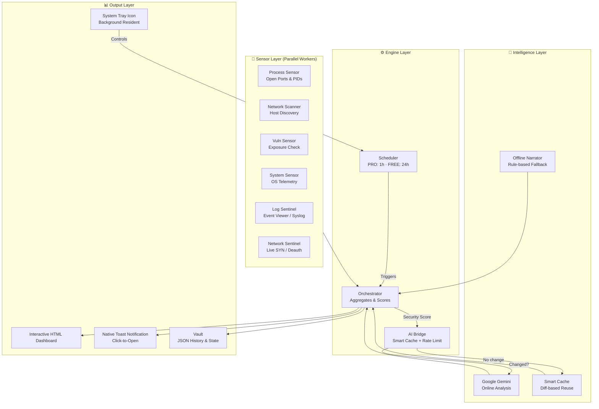

# 🛡️ Galt Security Agent

> **AI-Powered Personal Cybersecurity Agent — HIDS for Modern Endpoints**

[](https://github.com/dcooperdev/SecureAI/releases)
[](https://github.com/dcooperdev/SecureAI/actions)
[](https://www.python.org/)
[](https://github.com/dcooperdev/SecureAI)
[](https://github.com/dcooperdev/SecureAI)

Galt is a next-generation **HIDS (Host-Based Intrusion Detection System)** designed to protect endpoints through a hybrid architecture of local sensors, OS log analysis, and an AI brain powered by Google Gemini.  
It acts as a **Virtual CISO** — monitoring, analyzing, and educating users about their real-time security posture.

---

## 🏗️ System Architecture



### Data Flow Summary

```
Sensors ──► Orchestrator ──► AI Bridge ──► HTML Dashboard ──► Notification
                │                │
             Scoring          Smart Cache / Offline Fallback
```

| Layer | Technology | Role |
|---|---|---|
| **Sensors** | psutil · scapy · subprocess | OS-level data collection |
| **Orchestrator** | Python threading | Aggregation, scoring, drift detection |
| **AI Bridge** | Google Gemini API | Intelligent analysis with quota protection |
| **Dashboard** | Vanilla HTML/JS (serverless) | Offline-safe interactive report |
| **Distribution** | PyInstaller + Inno Setup | Single `.exe` installer for Windows |

---

## 🧩 Key Modules

### 🛡️ Network Sentinel (`core/network.py`)
Real-time network guardian running in a background thread.
- Uses **Scapy** in *safe sniffing* mode (no monitor mode required)
- Detects **TCP SYN Floods** and **Wi-Fi Deauth** attacks
- Triggers automatic firewall blocking via `FirewallManager` and sends native alerts

### 🕵️ Log Sentinel (`core/log_watcher.py`)
Forensic log auditor.
- Monitors OS logs (Windows Event Viewer / Linux Syslog)
- Detects forced Wi-Fi disconnections — the "physical evidence" that packet-level sniffing can miss

### 🔥 Firewall Manager (`core/defense.py`)
Active response layer.
- Integrates with **Windows Firewall** (`netsh`) and **iptables** on Linux
- Automatically blocks IPs flagged as malicious by the sentinels

### 🗣️ Offline Narrator (`ui/narrator.py`)
Intelligence fallback engine.
- Rule-based template engine that generates human-readable security explanations
- Ensures users always understand their findings, even without internet connectivity

### 🔔 Notifier (`core/notifier.py`)
Native alert system.
- Sends OS-native **Toast notifications**
- **Click-to-Open**: Uses Windows XML templates to open the Dashboard directly from the notification

### 🧠 AI Bridge (`engine/bridge.py`)
Smart Gemini integration.
- **Diff-based caching**: Only calls the API when findings actually change, saving quota
- **Rate limiting**: Enforces compatibility with the Gemini free tier (15 RPM)
- **Graceful degradation**: Falls back to the Offline Narrator on API errors

---

## 👨‍💻 Development Philosophy

### "Mock Everything"
Aggressive testing strategy to guarantee safety and speed.
- **Total Isolation**: `tests/conftest.py` uses `unittest.mock` to intercept **all** system calls (network, subprocess, files, AI API)
- **Safety**: Running `pytest` **never** sends real packets or modifies OS files
- **Efficiency**: Tests run in milliseconds with zero internet dependency

### Quota Protection
- Physical **rate limiting** in `bridge.py` prevents quota exhaustion during stress tests
- **Smart Cache** with JSON diff comparison reuses analysis when the security posture hasn't changed

---

## 🚀 Getting Started

### Prerequisites
- **Python 3.10+**
- **Npcap** *(Windows only — required for packet sniffing capabilities)*

### Installation

```bash
# 1. Clone the repository
git clone https://github.com/dcooperdev/SecureAI.git
cd SecureAI

# 2. Create virtual environment
python -m venv .venv

# Windows
.venv\Scripts\activate

# Linux / macOS
source .venv/bin/activate

# 3. Install dependencies
pip install -r requirements.txt

# 4. Configure API key
cp .env.example .env
# Edit .env and add your GOOGLE_API_KEY
```

### Running

#### 🏃 Production (System Tray Mode)
Start the background resident agent with 24/7 surveillance:
```bash
python main.py
```

#### 🧪 Testing (Fully Mocked, Zero Network Traffic)
```bash
pytest
```

#### 📊 Coverage Report
```bash
coverage run -m pytest && coverage report -m
```

---

## 📦 Distribution

The CI/CD pipeline automatically compiles and packages binaries for all platforms on every tagged release:

| Platform | Artifact | Method |
|---|---|---|
| 🪟 Windows | `GaltAI_Setup_vX.X.X.exe` | PyInstaller + Inno Setup |
| 🐧 Linux | `GaltAI_Linux.tar.gz` | PyInstaller onefile |
| 🍎 macOS | `GaltAI_Mac.zip` | PyInstaller onefile |

---

## 🌐 Language

> 🇬🇧 **English** — You're reading it!

---

**Galt Security Agent** — *Modular Architecture for Modern Cybersecurity.*
